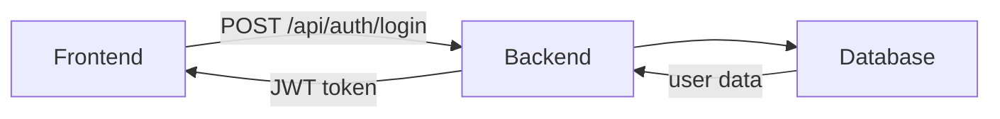

# Documentation Conventions

Este archivo define convenciones para mantener la documentación consistente y fácil de navegar.

## Formato y Estilo

### Títulos

```markdown
# Nivel 1: Nombre del documento o feature
## Nivel 2: Secciones principales
### Nivel 3: Subsecciones
#### Nivel 4: Detalles específicos
```

### Metadata

Usa un bloque de metadata al inicio de cada documento:

```markdown
# Feature: [Name]

**Status**: [In Design / In Development / Complete]  
**Owner**: [Optional: responsible person]  
**Last Updated**: [YYYY-MM-DD]
```

### Separadores

Usa `---` para separar secciones principales:

```markdown
## Section 1
Content...

---

## Section 2
Content...
```

## Documentación por Tipo

### Architecture Decision Records (ADRs)

**Ubicación**: `docs/adr/NNN-decision-title.md`

**Estructura**:
1. Título: `ADR-NNN: Decision Title`
2. Metadata: Status, Date
3. Context
4. Decision
5. Consequences (Positive, Negative, Neutral)
6. Related Decisions (links)
7. References (links)

**Naming**: Número secuencial (001, 002, 003...), nombres en kebab-case

### Feature Documentation

**Ubicación**: `docs/features/feature-name.md`

**Estructura**:
1. Metadata (Status, Owner, Last Updated)
2. Overview (What, Why, Scope)
3. API Endpoints (if applicable)
4. Backend (Module, Services, Entity, DTOs)
5. Frontend (Pages, Components, Store)
6. Data Flow
7. Testing
8. Acceptance Criteria
9. Risks & Mitigations
10. Related Features
11. Notes

**Naming**: Feature name in lowercase (auth, user-management, etc.)

## Tabla de Contenidos Automática

Para documentos largos (>1000 palabras), incluye una ToC al inicio:

```markdown
## Table of Contents
- [Section 1](#section-1)
- [Section 2](#section-2)
  - [Subsection 2.1](#subsection-21)
```

## Code Snippets

### Backend (TypeScript/NestJS)

```typescript
// Incluye el tipo y el camino del archivo como comentario
// src/modules/feature/feature.service.ts
@Injectable()
export class FeatureService {
  constructor(private userRepository: Repository<User>) {}
  
  async create(dto: CreateFeatureDto): Promise<FeatureDto> {
    // ...
  }
}
```

### Frontend (Vue/TypeScript)

```typescript
// app/pages/feature.vue (or stores/feature.ts, etc.)
const store = useFeaturesStore();
await store.fetchAll();
```

### Shell Commands

```bash
# Comment explaining what the command does
docker-compose exec backend npm test -- module/feature.spec.ts
```

### HTTP Requests (cURL)

```bash
# Description of the request
curl -X POST http://localhost:3000/api/feature \
  -H "Content-Type: application/json" \
  -d '{
    "field1": "value"
  }'
```

## Tablas

### Cuando usar tablas

✅ API parameters  
✅ Environment variables  
✅ Database schema  
✅ Options/trade-offs comparison  

### Formato

```markdown
| Column 1 | Column 2 | Notes |
|----------|----------|-------|
| Value 1  | Value 2  | Explanation |
```

**Pro tip**: Use tools like https://tablesgenerator.com/markdown_tables para generar tablas.

## Diagramas

### Flujo de datos (ASCII)

```markdown
[User Action]
  ↓
[Component/Page]
  ↓
[API Call]
  ↓
[Backend Logic]
  ↓
[Database Query]
  ↓
[Response]
```

### Relaciones (mencionadas en texto)

Si es muy complejo, describe en texto o referencia a un documento separado:

```markdown
### Entity Relationships

User → has many → Posts
Post → has many → Comments
```

### Para diagramas complejos

Si necesitas un diagrama visual, usa Mermaid (compatible con GitHub):



## Links

### Links internos

Usa rutas relativas:

```markdown
# Para features
See [ADR-001](../adr/001-jwt-auth.md) for details.

# Para ADRs
See [auth feature](../features/auth.md) for implementation.

# Mismo directorio
See [TEMPLATE.md](./TEMPLATE.md) for the template.
```

### Links externos

Incluye el dominio completo:

```markdown
[Passport.js Docs](https://www.passportjs.org/)
```

## Validación de Enlaces

Antes de mergear, verifica que:
- [ ] Todos los links internos existen
- [ ] Sintaxis markdown es válida
- [ ] No hay typos en nombres de archivo

```bash
# Check for broken links (if you have a tool installed)
md-links docs/**/*.md
```

## Versionado

Para cambios importantes en la documentación:

1. **Actualiza el "Last Updated" date**:
   ```markdown
   **Last Updated**: 2026-06-15  # Cambio de fecha
   ```

2. **Agrega notas de cambios al final** (si es necesario):
   ```markdown
   ## Changelog
   - 2026-06-15: Updated OAuth flow diagram
   - 2026-06-13: Initial documentation
   ```

3. **Para cambios mayores**: Crea un ADR describiendo el cambio arquitectónico

## Checklist para PR

Cuando subas código con cambios de documentación:

- [ ] Documentación actualizada para reflejar cambios de código
- [ ] Links internos son válidos
- [ ] Markdown sintaxis es correcta
- [ ] Ejemplos de código están actualizados
- [ ] Metadata (Last Updated date) está actualizada
- [ ] No hay typos

## Herramientas Recomendadas

| Herramienta | Uso | Link |
|-------------|-----|------|
| Markdown Linter | Valida sintaxis | https://github.com/markdownlint/markdownlint |
| TableGenerator | Crea tablas | https://www.tablesgenerator.com/markdown_tables |
| Mermaid | Diagramas | https://mermaid.js.org/ |
| Prettier | Formatea markdown | https://prettier.io/ |

## Ejemplos Buenos

✅ [`docs/features/auth.md`](./features/auth.md)  
✅ [`docs/adr/001-jwt-auth.md`](./adr/001-jwt-auth.md)  
✅ [`docs/ARCHITECTURE.md`](./ARCHITECTURE.md)  

## Ejemplos Malos (Evita)

❌ Documentación muy larga sin secciones claras  
❌ Code snippets sin contexto de archivo  
❌ Diagramas complejos en ASCII (usa Mermaid)  
❌ Links rotos o relativos incorrectos  
❌ Metadata no actualizada  
❌ Mezclar feature docs con ADRs  

## Preguntas Frecuentes

### ¿Debo documentar todo?

No. Documenta:
- ✅ Decisiones arquitectónicas importantes
- ✅ Features complejas (>1 endpoint, múltiples componentes)
- ✅ Configuración y setup
- ❌ Implementación interna (eso va en comentarios de código)

### ¿Quién actualiza la documentación?

El equipo que cambia el código. No es un trabajo post-hoc.

### ¿Con qué frecuencia revisar documentación?

- **Semanal**: Si hay cambios activos de código
- **Mensual**: Revisión de consistencia
- **Per PR**: Verifica que la doc esté sincronizada con code changes

## Contacto & Preguntas

Si tienes preguntas sobre las convenciones, abre un issue o pregunta en Slack.
